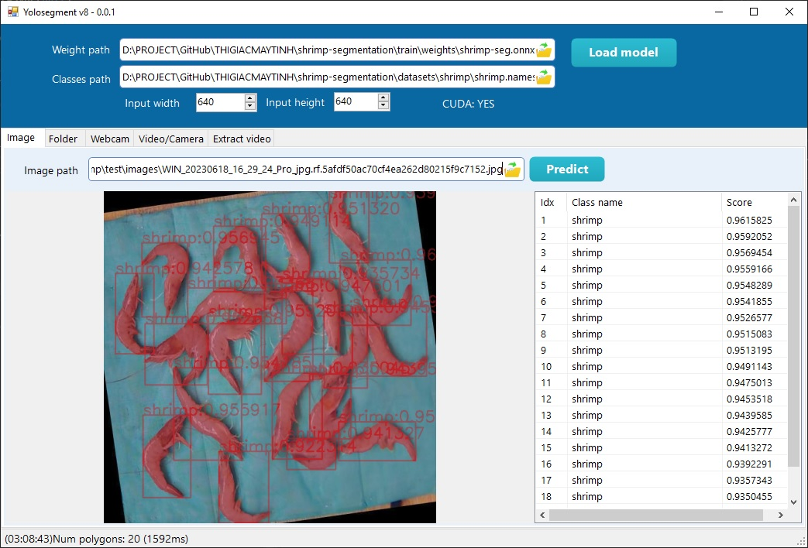

## Shrimp segmentation

Phân đoạn con tôm (phân tách hình ảnh tôm) là 1 ví dụ minh họa về ứng dụng của Object segmentation. 

## Giới thiệu chung
Thông qua repository này, các bạn có thể hiểu được công dụng của segmentation và tìm hiểu cách training.

Trong repository đã commit sẵn dataset gồm ảnh và label, mỗi dòng trong label chứa polygon (đa giác) bao lấy vật thể cần phát hiện. Quy tắc như sau:

`<Class ID> <cx> <cy> x1 y1 x2 y2 x3 y3....`

Giải thích các tham số:
- Class ID là số, đại diện cho class
- cx: giá trị center x của bounding box chứa polygon
- cy: giá trị center y của bounding box chứa polygon
- x y....: giá trị x và y của các điểm

Các giá trị này là số thập phân trong khoảng [0:1], tương tự như Object detection.

## Training
Do repository đã commit sẵn dataset nên các bạn không cần download dataset, chỉ cần sửa đường dẫn rồi ấn nút training là được.

Kết quả training nằm trong folder: **runs/segment/train/weights**

## Test 

Các bạn sử dụng phần mềm YOLOSEGMENT để test 

https://thigiacmaytinh.com/yolosegment-phan-mem-phan-doan-vat-the-manh-me-su-dung-yolo-v8/